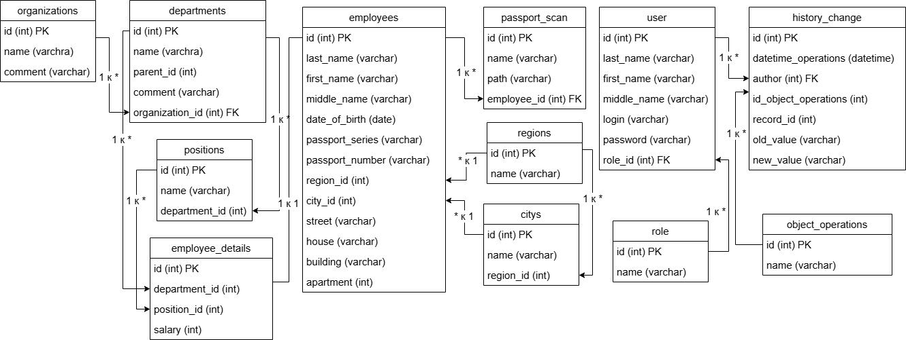

# Описание проекта

## Краткое описание

Этот проект предоставляет возможность управлять организациями, отделами, подотделами и должностями — добавлять, изменять и удалять записи. Также можно регистрировать сотрудников, редактировать их данные, увольнять, а также управлять их файлами. Все изменения фиксируются в истории. Дополнительно, приложение поддерживает управление пользователями: регистрацию, изменение данных, сброс паролей, повышение ролей и удаление пользователей. Доступ к управлению пользователями имеют только администраторы. В системе предусмотрены две роли: Администратор и Кадровый сотрудник.

## Используемые библиотеки

**Frontend**

Приложение построено с использованием Vue.js и следующих библиотек:

- Vite.js — инструмент для быстрой сборки и разработки.

- Vuetify — UI-фреймворк для Vue.js, предоставляющий готовые компоненты в стиле Material Design.

- vue-router — библиотека для маршрутизации и управления страницами приложения.

- axios — HTTP-клиент для выполнения запросов к API.

- date-fns — библиотека для работы с датами.

- dotenv — для работы с переменными окружения.

- pinia — состояние приложения, современная альтернатива Vuex.

- @mdi/font — иконки Material Design.

- @eslint/js, eslint, eslint-plugin-vue — инструменты для статического анализа и обеспечения качества кода.

- @vitejs/plugin-vue — плагин для интеграции Vue.js с Vite.

- cross-env — позволяет задавать переменные окружения для скриптов.

- globals — настройка глобальных переменных для линтинга.

**Backend**

Серверная часть построена на Node.js и включает:

- argon2, argon2id — библиотеки для безопасного хэширования паролей.

- body-parser — парсинг тела запросов.

- cors — настройка междоменного взаимодействия.

- dotenv — для работы с переменными окружения.

- express — фреймворк для создания веб-приложений.

- express-session — управление сессиями пользователей.

- joi — валидация данных.

- multer — работа с файлами и их загрузкой.

- node-pg-migrate — инструмент для миграции базы данных PostgreSQL.

- passport, passport-local — аутентификация и стратегия для локального входа.

- pg — взаимодействие с PostgreSQL.

- @eslint/js, eslint, globals — статический анализ кода.

- prettier — автоматическое форматирование кода.

## База данных

### Структура базы данных

### Организации и Отделы
- **organizations(id)** и **departments(organization_id)**
  - Связь: Один ко многим
  - Описание: В одной организации может находиться несколько отделов, один отдел находится в одной организации.

### Отделы и Вложенные Отделы
- **departments(id)** и **departments(parent_id)**
  - Связь: Один ко многим
  - Описание: Отделы могут содержать вложенные отделы.

### Должности и Отделы
- **positions(department_id)** и **departments(id)**
  - Связь: Многие к одному
  - Описание: В одном отделе может существовать несколько должностей, одна должность существует в одном отделе.

### Отделы и Данные о сотруднике
- **departments(id)** и **employee_details(department_id)**
  - Связь: Один ко многим
  - Описание: Один отдел может иметь множество кадровых операций, а одна кадровая операция имеет один отдел.

### Должности и Данные о сотруднике
- **positions(id)** и **employee_details(position_id)**
  - Связь: Один ко многим
  - Описание: Одна должность может быть связана с несколькими кадровыми операциями, а одна кадровая операция связана с одной должностью.

### Сотрудники и Данные о сотруднике
- **employees(id)** и **employee_details(id)**
  - Связь: Один ко одному 
  - Описание: Каждая запись в таблице Сотрудники соответствует ровно одной записи в таблице Детали сотрудника, и наоборот.

### Регионы и Сотрудники
- **regions(id)** и **employees(region_id)**
  - Связь: Один ко многим
  - Описание: С одного региона может быть несколько сотрудников, а один сотрудник с одного региона.

### Регионы и Города
- **regions(id)** и **citys(region_id)**
  - Связь: Один ко многим
  - Описание: В одном регионе может находиться несколько городов, а один город находится в одном регионе.

### Города и Сотрудники
- **citys(id)** и **employees(city_id)**
  - Связь: Один ко многим
  - Описание: В одном городе может жить несколько сотрудников, а один сотрудник живет в одном городе.

### Сотрудники и Сканирование паспортов
- **employees(id)** и **passport_scan(employee_id)**
  - Связь: Один ко многим
  - Описание: Один сотрудник может иметь несколько файлов, один файл может принадлежать нескольким сотрудникам.

### Операции с объектами и История изменений
- **object_operations(id)** и **history_change(id_object_operations)**
  - Связь: Один ко многим
  - Описание: Каждая запись в таблице операций с объектами может иметь множество связанных изменений. Каждое изменение в истории относится только к одной конкретной операции.

### Пользователь и История изменений
- **user** и **history_change**
  - Связь: Один ко многим
  - Описание: Каждая запись в таблице history_change имеет автора (пользователя), указавшего изменения. Один пользователь может быть автором нескольких записей в истории изменений.

### Пользователь и роль
- **user** и **role**
  - Связь: Многие к одному
  - Описание: Каждый пользователь принадлежит к одной роли, но одна роль может быть назначена нескольким пользователям.

### Объекты операций
1. Организация
2. Отдел
3. Должность
4. Сотрудник
5. Пользователи